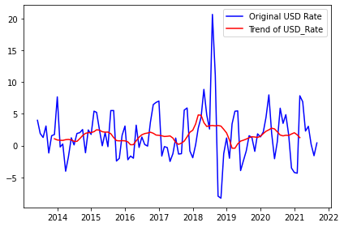
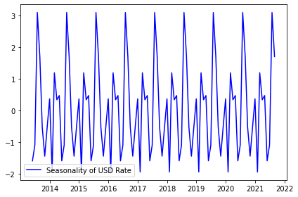
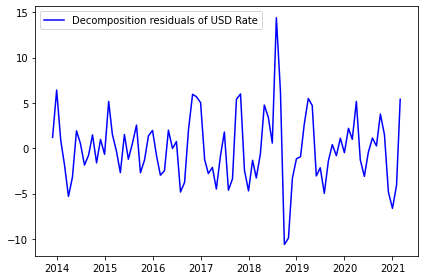
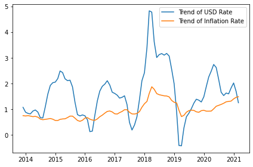

# Data Science Utilities and Helpers

```
pip install dats-lab
```

seasonal_all(df, "USD_mean_Rate", "USD Rate")







trends(df, ["USD_mean_Rate", "Inflation_Rate"], ["USD Rate", "Inflation Rate"])


